# IO-Multiplexing
从内核源码解读select、poll、epoll
## 一、 select内核实现
1. select系统调用入口

2. 参数：
 - n： 需要监听的文件描述符个数；
 - inp： 需要监听的输入文件描述符集合；
 - outp： 需要监听的输出文件描述符集合；
 - exp： 需要监听的异常文件描述符集合；
 - tvp： 用户态指定的等待时间长度，单位为秒和微秒，有以下三种情况：1.tvp == null，永远等待；2.tvp.tv_sec == 0 && tvp.tv_usec == 0，根本不等待，测试完所有指定的描述符并立即返回，这是轮询系统找到多个描述符而不阻塞select函数的方法；3.tvp.tv_sec != 0 || tvp.tv_usec != 0，等待指定的秒数和微秒数，当指定的描述符之一已准备好或当指定的时间值已经超过时立即返回
3. 详细实现流程：
 - 如果tvp != null，将用户空间的时间参数tvp通过copy_from_user传递到内核空间，timeval类型的时间结构体是从1970年1月1号开始的秒数以及微秒数，timespec是从1970年1月1号开始的秒数和纳秒数。poll_select_set_timeout修正时间。
 - 调用core_sys_select，该函数原型为：
 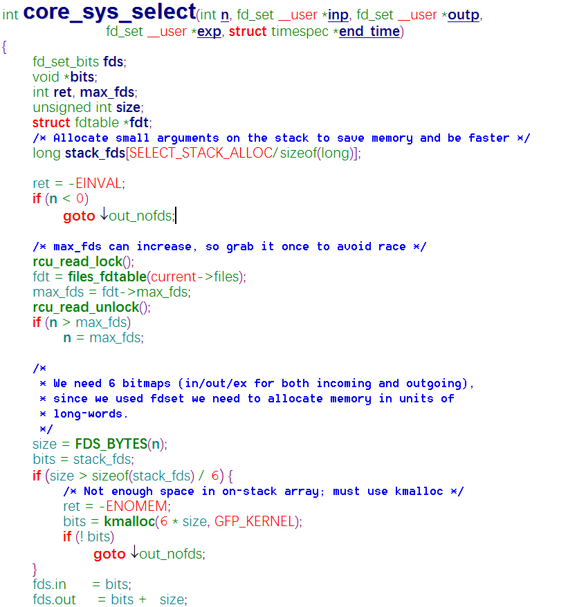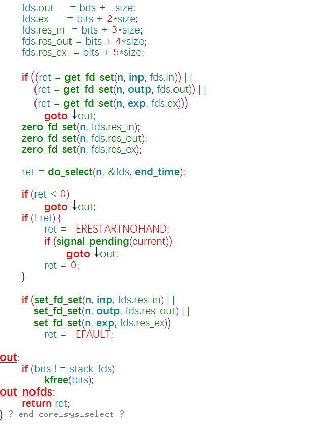 
 首先将文件描述符位图分配在栈上，这样可以节省内存空间而且会更快。SELECT_STACK_ALLOC = 256，所以stack_fds为大小32的long数组。也就是说如果需要监听的文件描述符的位图占有的字节数大于32 * 4 / 6必须在内存中分配位图，这里除6的原因是需要六组位图，分别保存输入/输出/异常的输入结果以及输出结果。初始化分配好的位图fds，其中输入描述符根据用户传入的参数初始化，结果描述符初始化为0。  
 调用do_select，该函数原型为：
 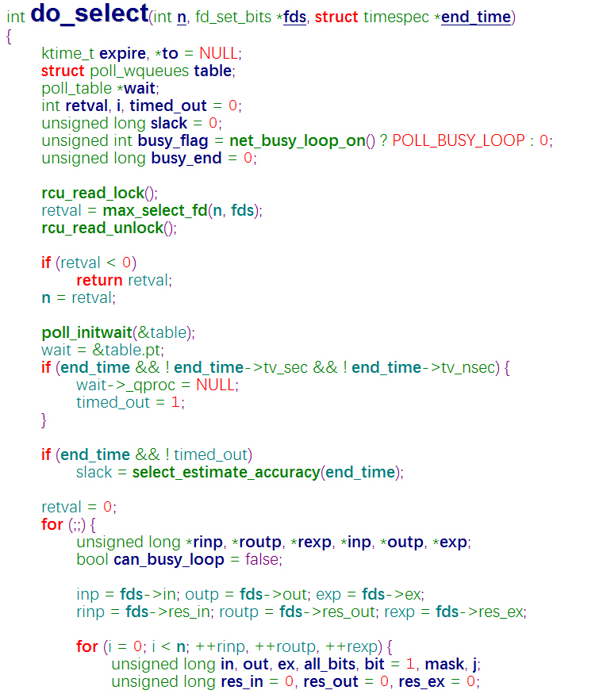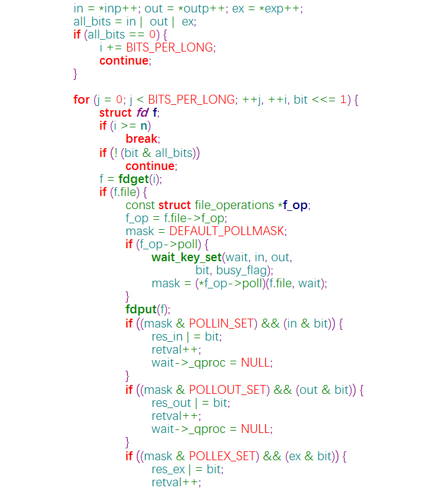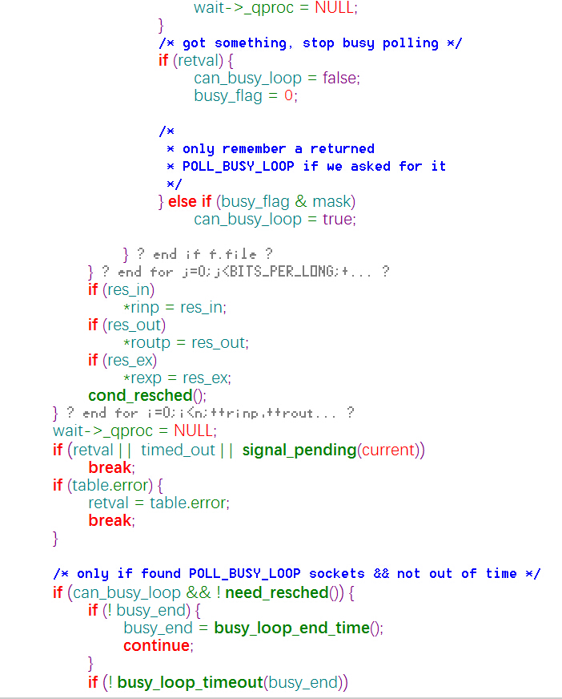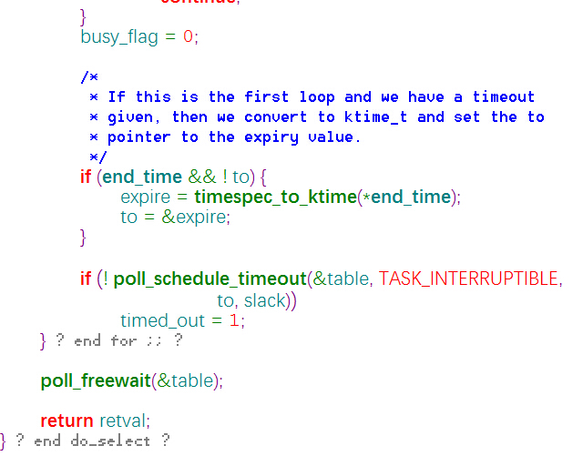 
 其中的定义局部变量以及变量修正部分略过不谈，从poll_initwait这个重要的步骤谈起。poll_initwait的本质是为当前进程注册一个回调函数__pollwait，因为select以及poll轮询的时候当前进程会被阻塞，当前进程被唤醒的时候就会去调用__pollwait函数。然后内核进入for(;;)开始轮询，在Linux内核2.* 版本的时候（具体版本没有仔细研究过）进入轮询之后立即将当前进程current挂起，然后才去轮询。在Linux3.10及之后版本的内核是先去轮询一遍文件描述符位图，如果没有可用的文件描述符才会将当前进程挂起，然后再去轮询。这样修改的好处是显而易见的。 
 在第一层内层循环中，用all_bits组合需要轮询的输入/输出/异常文件描述符，因为文件描述符都是long类型的位图，所以每次检查4 * 8位，如果all_bits == 0，也就是说当前的输入/输出/异常文件描述符均为0，则 i += BITS_PER_LONG；如果all_bits ！= 0，则输入/输出/异常文件描述符其中有为1的位，进入第二层内层循环遍历找出为1（准备好）的文件描述符 
 在第二层内层循环中，通过bit控制每次查找all_bits的一位。当找到为1的那一位说明第一层循环中当前i描述符已经准备好，通过fdget(i)获得该文件的文件对象，同时如果文件驱动定义了poll函数，就把当前的文件描述符绑定在poll_initwait初始化的一个阻塞队列上，并将该阻塞队列设置为该文件驱动的阻塞队列。到目前为止，内核将当前进程挂在了已经准备好的文件描述符的文件的阻塞队列上，**注意**，此时的进程不一定被阻塞。第二层循环剩下的工作就是找到为1的那一位的文件描述符到底是输入文件描述符还是输出文件描述符或者是异常文件描述符，并将统计准备好文件描述符个数变量retval++。 
 第二层循环结束之后，第一层循环还需做一些判断，如果找到可用文件描述符、超时、当前进程需要处理信号，则退出轮询，如果当前为超时而且也没有找到可用的文件描述符，将当前进程状态设置为TASK_INTERRUPTIBLE阻塞。 
 结束轮询之后调用poll_freewait释放等待队列。
 - 调用poll_select_copy_remaining，将剩余时间传给用户空间。 
## 二、 poll内核实现
虽然poll内核实现方式不同（poll是通过poll_list结构保存需要遍历的文件描述符），但是原理和select一样，这里略过不谈。 
## 三、 epoll内核实现
1. epoll实现被分成了三个系统调用，分别是epoll_create、epoll_ctl、epoll_wait，它们的入口分别是：
 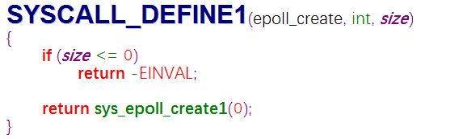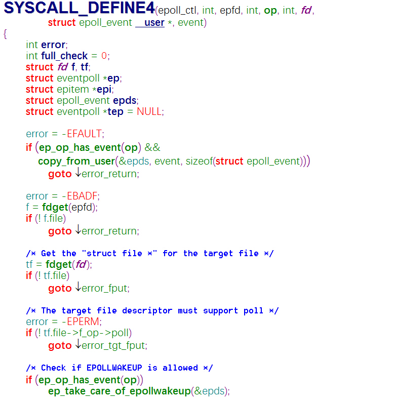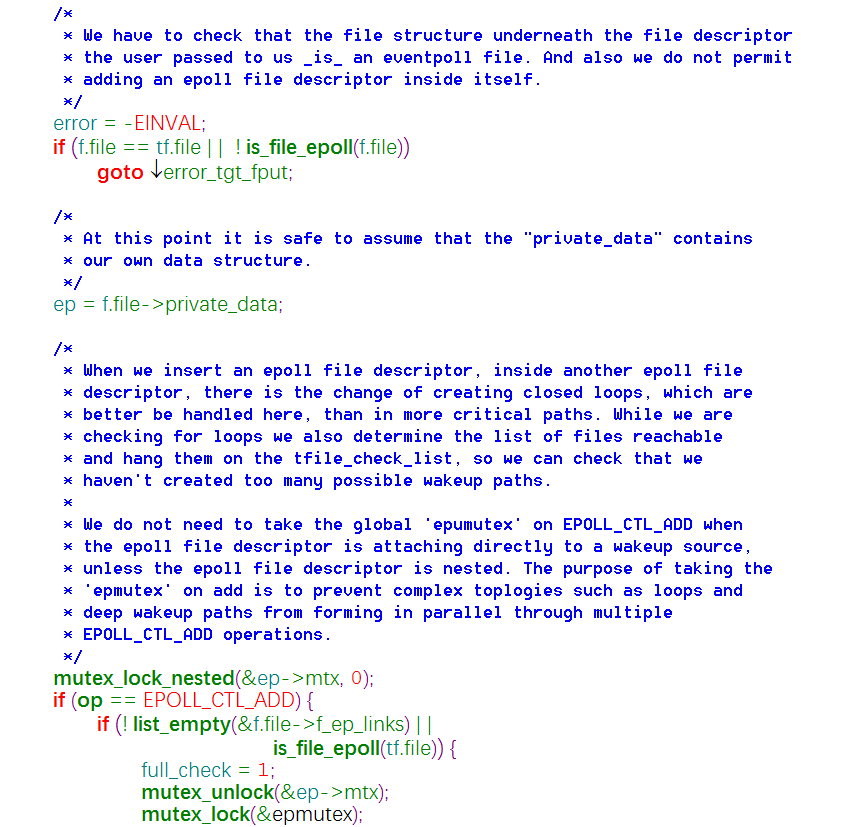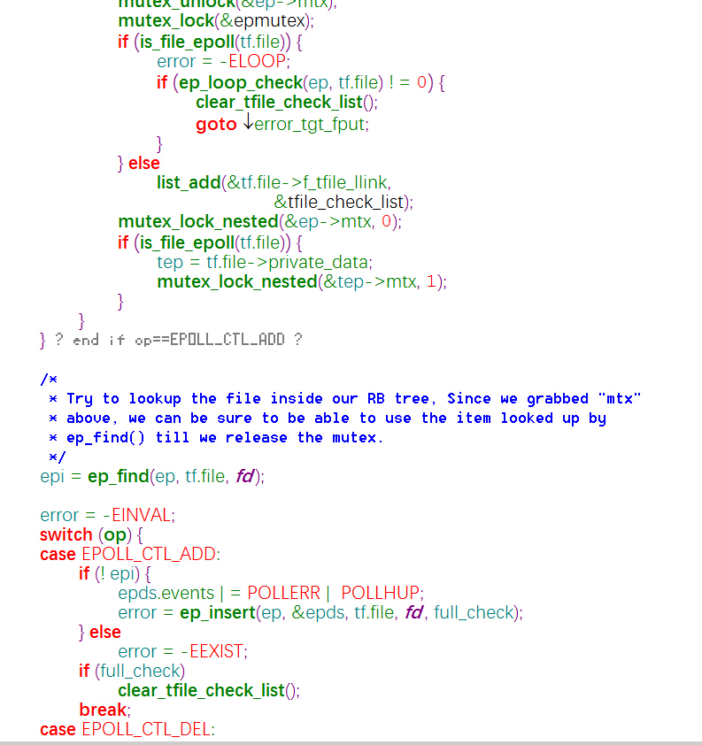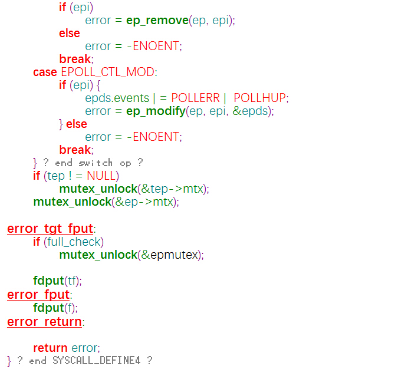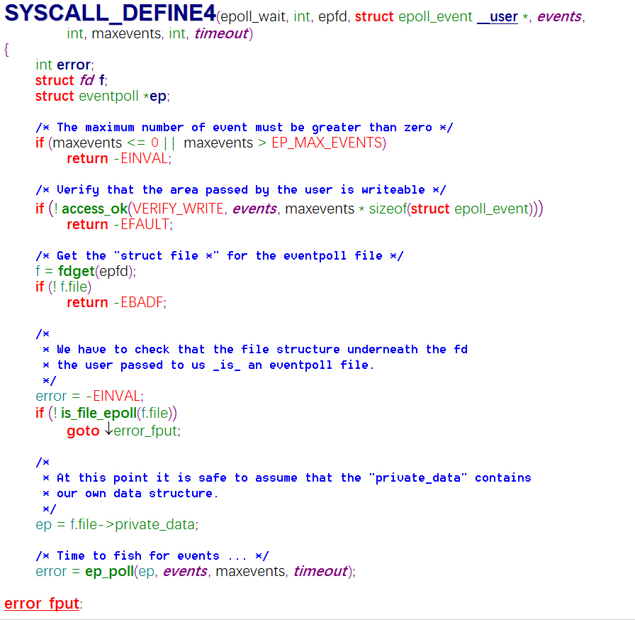
2. 实现原理：
 - 执行epoll_create时，创建了红黑树和就绪list链表。
 - 执行epoll_ctl时，如果增加fd（socket），则检查在红黑树中是否存在，存在立即返回，不存在则添加到红黑树上，然后向内核注册回调函数，用于当中断事件来临时向准备就绪list链表中插入数据。
 - 执行epoll_wait时立刻返回准备就绪链表里的数据即可。