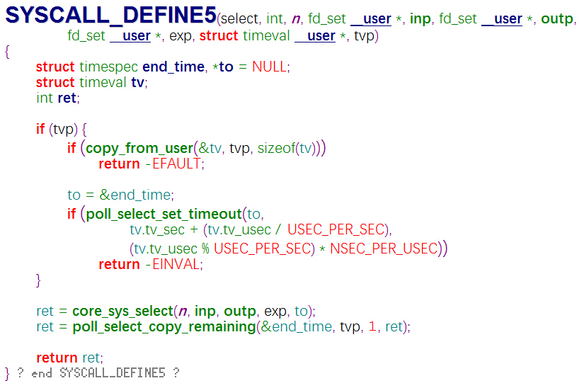

# IO-Multiplexing
从内核源码解读select、poll、epoll
## select内核实现
1. select系统调用入口

2. 参数：
- n： 已经准备好的描述符总数量；
- inp： 需要监听的输入文件描述符集合；
- outp： 需要监听的输出文件描述符集合；
- exp： 需要监听的异常文件描述符集合；
- tvp： 用户态指定的等待时间长度，单位为秒和微秒，有以下三种情况：1.tvp == null，永远等待；2.tvp.tv_sec == 0 && tvp.tv_usec == 0，根本不等待，测试完所有指定的描述符并立即返回，这是轮询系统找到多个描述符而不阻塞select函数的方法；3.tvp.tv_sec != 0 || tvp.tv_usec != 0，等待指定的秒数和微秒数，当指定的描述符之一已准备好或当指定的时间值已经超过时立即返回
3. 详细实现流程：
- 如果tvp != null，
4. 